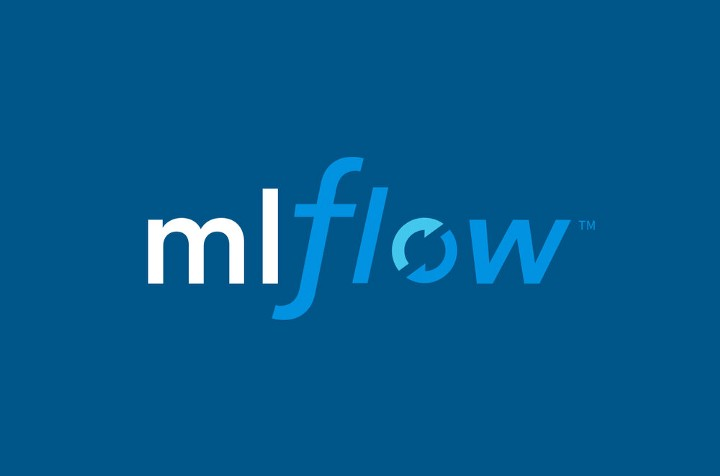

# Training and logging with [MLflow](https://mlflow.org/) 

This project explores and exemplifies the different ways in MLflow of training and logging (Python) machine learning models. 

To run all of the included examples, install: [`Python`](https://www.python.org/downloads/), [`miniconda`](https://docs.conda.io/en/latest/miniconda.html), [`virtualenv`](https://pypi.org/project/virtualenv/), [`docker`](https://docs.docker.com/get-docker/), [`pyenv`](https://github.com/pyenv/pyenv) and [`mlflow`](https://pypi.org/project/mlflow/)>=2.0.

## :candy: Model flavors

MLflow provides support several standard [model flavors](https://mlflow.org/docs/latest/models.html#built-in-model-flavors) meaning either model frameworks (e.g. `pytorch`, `tensorflow` or `scikit-learn`) or specific algorithms (e.g. `CatBoost`, `xgboost` or `LightGBM`) out-of-the-box. 

### Built-in flavors

Training and logging a model with one of the the built-in model flavors is straightforward:

```bash
python train.py
```

### Custom flavor

Training and logging a model with a custom model flavor requires more footwork. In this case the model developer must implement a model wrapper for the custom model inheriting from the `mlflow.pyfunc.PythonModel` and equip it with specific methods like `load_context()` and `predict()`. The model is then trained by invoking:

```bash
python train_custom.py --n_obs 15000
```

## :shell: Built-in Command-Line Interface

MLflow offers a convenient built-in command-line interface for training and logging models: `mlflow run`:

```bash
mlflow run . -e training --env-manager local
```

`mlflow run` requires an `MLproject` file specifying project specific options. In my taste, the `MLproject` should be kept as slim as possible but at least specify training entrypoints.

## :computer: Computational environments

The above experiments are all run in the activen local environment. This means maximum flexibility on the developer side, which is great, but it also implies minimum reproducibility of the results. 

For increased environment reproducibility MLflow offers support for environment managers: `virtualenv`, `conda` and `Docker`.  

### `virtualenv` environment

The default environment manager in 'mlflow' is 'virtualenv'. When calling `mlflow run` with `virtualenv` as environment manager, a virtual environment is created from `python_env.yaml`, and the model is trained in that environment.

```bash
mlflow run . -e training --env-manager virtualenv
```

### `conda` environment

Analog to `virtualenv`. The `conda` environment is created from `conda.yaml`.

```bash
mlflow run . -e training --env-manager conda
```
*NOTE*: for some reason `conda_env: conda.yaml` must be set in `MLproject` to actually run this example (has to be a bug in MLflow?).

### Docker container

MLflow also has support for training a model in a Docker environment. As opposed to `conda` and `virtualenv` this allows for capturing non-Python dependencies, e.g. Java libraries.

See [this project](https://github.com/smaakage85/mlflowdocker) for an example.
